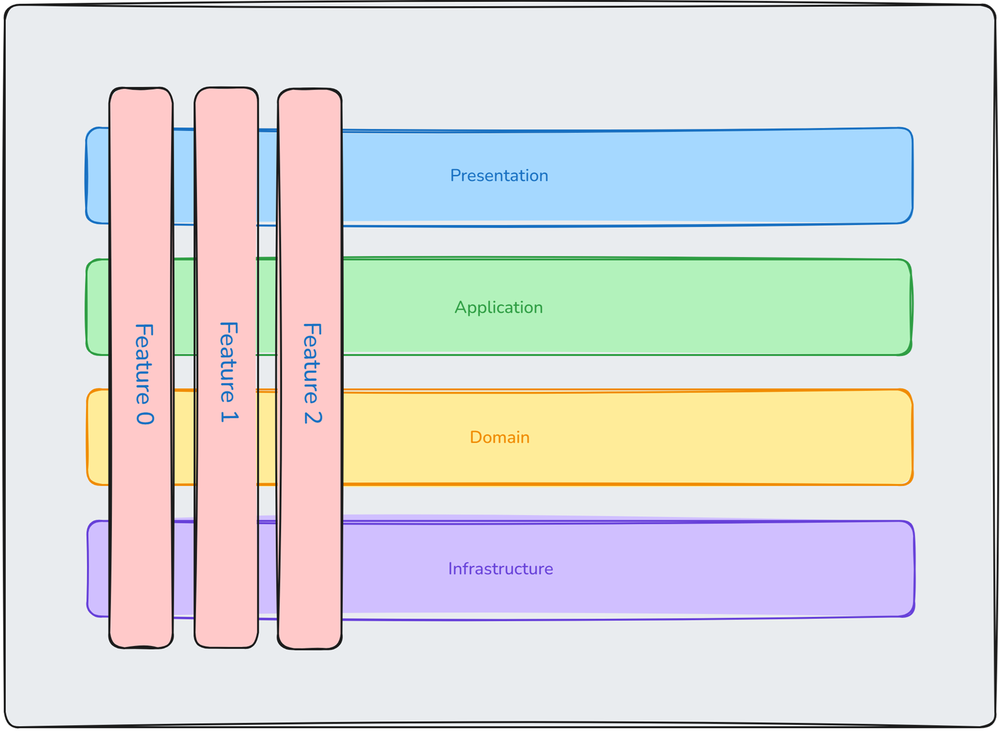
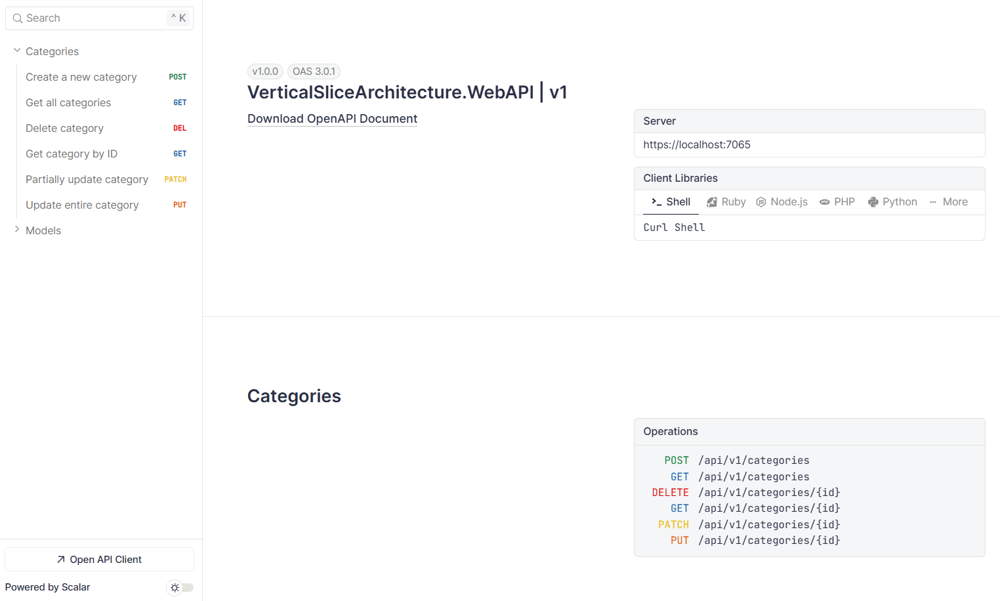
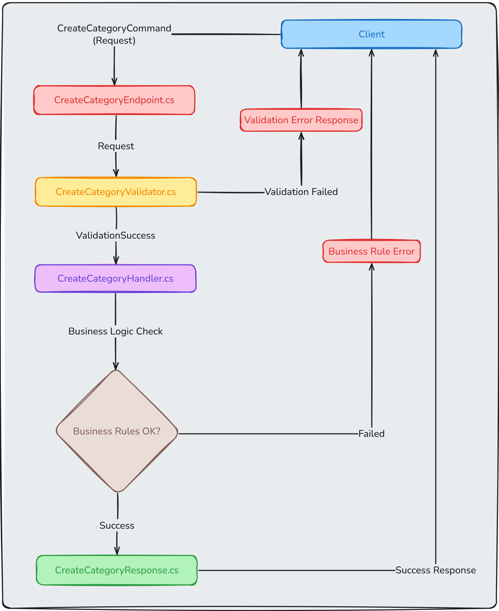

# Vertical Slice Architecture Template

Bu proje, **.NET 9** ile geliştirilmiş, modern ve modüler bir **Web API mimari şablonudur**. Vertical Slice Architecture (Dikey Dilim Mimarisi) yaklaşımını; modern .NET ekosistemi ile harmanlayarak, yeni nesil web uygulamaları için sağlam ve ölçeklenebilir bir temel sağlar.

---

## API Arayüzü

---

## Mimaride Neler Var?

**Vertical Slice Architecture**, klasik katmanlı mimariden farklı olarak sistemi işlevsel parçalara ayırır. Her özellik kendi diliminde izole çalışır. Örneğin:

`CreateCategory` özelliği kendi içinde şu yapıları barındırır:

<pre>
📁 Features/Categories/CreateCategory/
├── 📄 <b>CreateCategoryCommand.cs</b>       // Request modeli (Giriş)
├── 📄 <b>CreateCategoryHandler.cs</b>       // İş mantığı işleyicisi  
├── 📄 <b>CreateCategoryValidator.cs</b>     // FluentValidation kuralları
├── 📄 <b>CreateCategoryResponse.cs</b>      // Response DTO (Çıkış)
└── 📄 <b>CreateCategoryEndpoint.cs</b>      // Minimal API endpoint'i
</pre>

> Features klasörü, uygulamadaki her işlevsel özelliğin (örneğin Kategori, Kullanıcı, Ürün) birbirinden izole şekilde, kendi veri modelleri, iş mantığı ve endpoint'leri ile bir bütün olarak tanımlandığı yerdir. Bu yapı, kod tekrarını azaltır ve bağımsız geliştirme/test avantajı sağlar.

---

## REPR(+V) Yapısı

**REPR(+V)** mimari akışına göre organize edilmiştir:

> **Request → Endpoint → Processor → Response (+Validator)**

| Aşama              | Açıklama                                                                  |
| ------------------ | ------------------------------------------------------------------------- |
| **Request**        | Client'tan gelen veriyi temsil eden `Command` veya `Query` sınıfıdır.     |
| **Endpoint**       | API'nin dış dünyaya açılan kapısıdır. Gelen request burada karşılanır.    |
| **Processor**      | İş mantığının işlendiği `Handler` sınıfıdır. CQRS mantığına göre ayrılır. |
| **Response**       | İşlem sonucunda client'a dönen veri modelidir. Genellikle DTO’dur.        |
| **Validator (+V)** | FluentValidation kullanılarak request’in doğrulandığı yerdir.             |

---

## REPR+V Pattern Akış Diyagramı

---

## Kullanılan Teknolojiler ve Araçlar

| Teknoloji / Kütüphane                                                                                    | Açıklama                                                     |
| -------------------------------------------------------------------------------------------------------- | ------------------------------------------------------------ |
| **[.NET 9](https://dotnet.microsoft.com/en-us/download/dotnet/9.0)**                                     | Güncel .NET sürümü                                           |
| **[Minimal API](https://learn.microsoft.com/en-us/aspnet/core/fundamentals/minimal-apis)**               | Daha sade, hızlı ve fonksiyonel endpoint yapısı              |
| **[Entity Framework Core (Code First)](https://learn.microsoft.com/en-us/ef/core/)**                     | ORM aracı, SQL Server ile birlikte kullanıldı                |
| **[FluentValidation](https://fluentvalidation.net/)**                                                    | Request doğrulama işlemleri                                  |
| **[Scrutor](https://github.com/khellang/Scrutor)**                                                       | Assembly üzerinden otomatik servis kayıtları (DI için)       |
| **[OpenAPI](https://swagger.io/specification/) / [Scalar.AspNetCore](https://github.com/scalar/scalar)** | API dokümantasyonu ve Scalar arayüzü                         |
| **[CQRS (Manual Handler)](https://learn.microsoft.com/en-us/azure/architecture/patterns/cqrs)**          | Komut ve sorgular için kendi handler yapısı (MediatR yerine) |

---

## Lisans

Bu proje [MIT Lisansı](https://github.com/ramazanaltintop/vertical-slice-architecture/blob/main/LICENSE) ile lisanslanmıştır.
